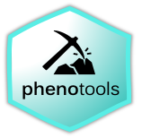
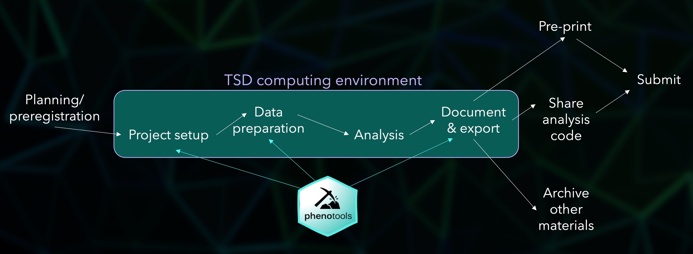
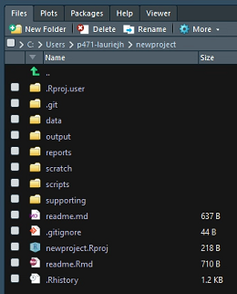

<!-- README.md is generated from README.Rmd. Please edit that file -->

```{r setup, include = FALSE}
knitr::opts_chunk$set(
  collapse = TRUE,
  comment = "#>",
  fig.path = "man/figures/README-",
  out.width = "100%"
)
library(phenotools)
```





# phenotools


The goal of the **phenotools** package is to facilitate efficient and reproducible use of phenotypic data from MoBa and linked registry sources in the TSD environment. 

Please contact laurie.hannigan@bristol.ac.uk with bugs, feedback, or development ideas.

&nbsp;

## Installation

**phenotools** is built and runs entirely within the [TSD](https://www.uio.no/english/services/it/research/sensitive-data/) environment, in which MoBa data are accessed for analyses. As such, you can't install the package directly from github. Instead, you should download the binary for the latest working version from [here](https://osf.io/6g8bj/files/), import to a sensible location in your project in TSD and install in R as follows, amending the path appropriately:

```{r install, echo=TRUE, eval= FALSE}
install.packages("//tsd-evs/p471/data/durable/common/software/phenotools_0.2.7.zip", 
                 repos=NULL,
                 type = "binary")
```

Depending on the R version you are working with in TSD, any missing dependencies may be able to be installed manually from the TSD CRAN copy, i.e.,

```{r dependencies, echo=TRUE, eval= FALSE}
install.packages('dplyr',
                 repos = "file://tsd-evs/shared/R/cran")
```

Otherwise, you will need to download the binaries for those packages and import to TSD. You could make use of the [miniCRAN](https://cran.r-project.org/web/packages/miniCRAN/index.html) package if you need to install a lot of packages in one go.

&nbsp;
&nbsp;

## Overview and project set-up


The **phenotools** package primarily provides functions to assist you at the beginning and end of your analytic workflow; specifically, in the respective areas of data preparation, and analysis documentation and reporting.


<center>

</center>

These functions are outlined below. However, to make full usage of the phenotools package, it is advisable to begin by using it to set up your analytic project with a pre-defined structure using the `initialise_project` function:

```{r initialise, echo=T} 
initialise_project(path="C:/Users/p471-lauriejh/newproject",
                   template_filepath="//tsd-evs/p471/data/durable/common/new_project_template/.")
```

This creates a project directory and Rstudio .proj file in your specified location, populated with sub-directories and files from a template - shown here in the "Files" pane in Rstudio after opening the new project:

<center>




</center>

Using this template helps to keep consistency across analytic projects, making collaboration and reproducible working easier. Moreover, some of phenotools' reporting functions make use of this structure to find relevant files and combine them for export, so deviating too far from this core structure will restrict the extent to which the package can help you at the other end. The template is available for download [here](https://osf.io/6g8bj/files/).

For instructions on how to use the main package functions for data preparation and reporting, see the package vignette (run `vignette("phenotools")`)`.

