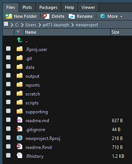

<!-- README.md is generated from README.Rmd. Please edit that file -->

<figure>

<figcaption aria-hidden="true">Phenotools.</figcaption>
</figure>

# phenotools

The goal of the **phenotools** package is to facilitate efficient and
reproducible use of phenotypic data from MoBa and linked registry
sources in the TSD environment.

Please contact [Laurie
Hannigan](mailto:laurie.hannigan@bristol.ac.uk;laurie.hannigan@lds.no)
with bugs, feedback, or development ideas.

 

## Installation

**phenotools** is built and runs entirely within the
[TSD](https://www.uio.no/english/services/it/research/sensitive-data/)
environment, in which MoBa data are accessed for analyses. As such, you
can’t install the package directly from github. Instead, for
installation on Windows you should download the binary for the latest
working version from [here](https://osf.io/6g8bj/files/), import to a
sensible location in your project in TSD and install in R as follows,
amending the path and package version appropriately:

``` r
install.packages("//ess01/P471/data/durable/common/software/phenotools_x.y.z.zip", 
                 repos=NULL,
                 type = "binary")
```

To install the package on Linux, you should clone this repo, import to
TSD and install from source.

Depending on the R version you are working with in TSD, any missing
dependencies may be able to be installed manually from the TSD CRAN
copy, i.e.,

``` r
install.packages('dplyr',
                 repos = "file://ess01/shared/R/cran")
```

Otherwise, you will need to download the binaries for those packages and
import to TSD. You could make use of the
[miniCRAN](https://cran.r-project.org/web/packages/miniCRAN/index.html)
package if you need to install a lot of packages in one go.

   

## Overview and project set-up

The **phenotools** package primarily provides functions to assist you at
the beginning and end of your analytic workflow; specifically, in the
respective areas of data preparation, and analysis documentation and
reporting.

<center>

<figure>

<figcaption aria-hidden="true">Phenotools in TSD reproducible
workflow.</figcaption>
</figure>

</center>

These functions are outlined below. However, to make full usage of the
phenotools package, it is advisable to begin by using it to set up your
analytic project with a pre-defined structure using the
`initialise_project` function:

``` r
initialise_project(path="C:/Users/p471-lauriejh/newproject",
                   template_filepath="//ess01/P471/data/durable/common/new_project_template/.")
#> Initialising...
#> Warning in file.rename(from = paste0(path, "/new_project_template.Rproj"), :
#> cannot rename file
#> 'C:/Users/p471-lauriejh/newproject/new_project_template.Rproj' to
#> 'C:/Users/p471-lauriejh/newproject/newproject.Rproj', reason 'No such file or
#> directory'
#> 
#> Project initialised successfully. Open via Rstudio>File>Open project...
#> or open the >yourproject<.Rproj file from Windows Explorer.
```

This creates a project directory and Rstudio .proj file in your
specified location, populated with sub-directories and files from a
template - shown here in the “Files” pane in Rstudio after opening the
new project:

<center>

<figure>

<figcaption aria-hidden="true">file structure screenshot</figcaption>
</figure>

</center>

Using this template helps to keep consistency across analytic projects,
making collaboration and reproducible working easier. Moreover, some of
phenotools’ reporting functions make use of this structure to find
relevant files and combine them for export, so deviating too far from
this core structure will restrict the extent to which the package can
help you at the other end. The template is available for download
[here](https://osf.io/6g8bj/files/).

For instructions on how to use the main package functions for data
preparation and reporting, see the package vignette (run
`vignette("phenotools")`)\`.
